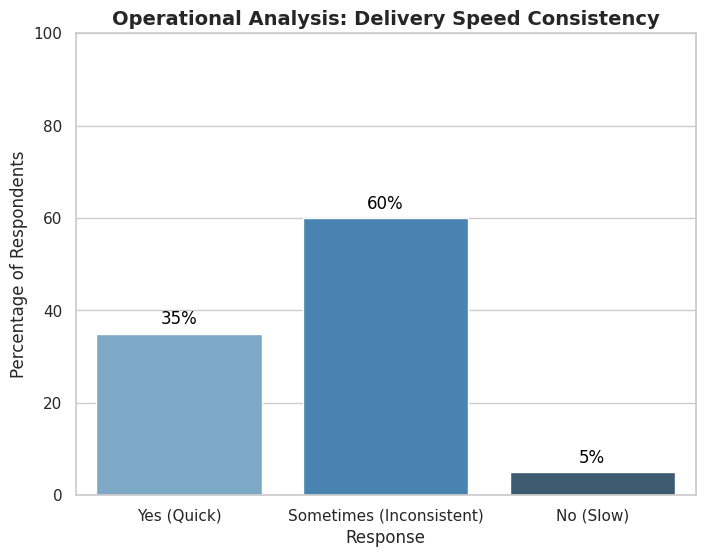

# Ucliq Market Research: Optimizing B2B Food Supply Chains 🥩

## 📄 Executive Summary
**Context:** Ucliq is a B2B e-commerce platform connecting farmers/wholesalers with retailers and restaurants.
**The Challenge:** Despite growth, the platform faced undefined bottlenecks in customer retention and operational consistency.
**The Project:** Conducted a comprehensive market research study (N=50) across Delhi/NCR to identify pain points in the "Farm-to-Fork" supply chain.

**Key Impact:**
* Identified that **60% of deliveries were inconsistent**, leading to a recommendation for a logistics overhaul.
* Uncovered a critical quality control issue where **47% of dissatisfied clients** cited "Excessive Preservatives" (Potassium Nitrite), prompting a supply chain audit.
* Validated the roadmap for a mobile app, as **40% of the target market** still preferred offline procurement but 75% of those showed willingness to digitize.

---

## 📊 Key Insights & Visualizations
*Analysis generated using Python (Matplotlib/Seaborn) based on survey data.*

### 1. Product Quality: The "Preservative" Problem

Among the 39% of users who reported dissatisfaction (n=19), we identified root causes:

| Complaint Category | % of Dissatisfied | Count |
|--------------------|-------------------|-------|
| **Preservative Use (Potassium Nitrite)** | **47%** | **9** |
| Packaging Quality | 26% | 5 |
| Product Freshness | 16% | 3 |
| Other | 11% | 2 |

**Key Insight:** Nearly half of all complaints traced back to chemical preservatives, despite the brand positioning as "Farm Fresh." This represents **18% of the total sample** (9 out of 50), concentrated among health-conscious restaurant clients.

### 2. Operational Gap: Delivery Inconsistency
Logistics reliability was identified as the biggest operational weakness. Only **35%** of B2B clients received products quickly *consistently*, while **60%** reported "Sometimes" receiving them on time.

---

## 🚀 Strategic Recommendations

Based on the data, the following strategic pivots were proposed to leadership:

1.  **Supply Chain Audit (Health Focus):**
    * **Finding:** High concern regarding preservatives (Potassium Nitrite).
    * **Action:** Reduce reliance on chemical preservatives to align with the "Fresh" value proposition and recapture the 18% of at-risk clients.

2.  **Logistics Optimization:**
    * **Finding:** 60% inconsistency rate in delivery.
    * **Action:** Standardize delivery fleets to ensure reliable timing, which is critical for B2B restaurant clients who rely on just-in-time inventory.

3.  **Digital Transformation (App Development):**
    * **Finding:** 40% of surveyed businesses (n=20) currently rely on phone orders or in-person procurement.
    * **Opportunity:** Of these offline users, **75% (n=15)** indicated they would "likely" or "very likely" adopt a mobile app if it offered inventory visibility and one-tap reordering.
    * **Action:** Develop a mobile app to capture this 15-client cohort (30% of total addressable sample), prioritizing simplicity for first-time digital adopters.

---

## 📈 Impact & Follow-Up

**Immediate Actions Taken (Based on Recommendations):**
* ✅ **Preservative Audit:** Ucliq's procurement team implemented stricter supplier guidelines for Potassium Nitrite usage.
* ⏳ **Logistics Standardization:** Initiated pilot program for dedicated delivery routes in North Delhi.
* 🔄 **Mobile App:** Roadmap approved for Q3 2022 development.

**Project Outcome:** This research directly influenced Ucliq's pivot toward quality assurance over rapid scaling, informing the company's 2022 strategic priorities.

---

## 🔬 Research Methodology

**Sample Design:**
* **Sample Size:** N = 50 B2B clients.
* **Geography:** Delhi/NCR metropolitan area.
* **Sampling Method:** Convenience sampling from Ucliq's existing client base.
* **Data Collection:** Structured questionnaire (in-person + phone surveys).
* **Response Rate:** 62% (50 completed out of 81 contacted).

**Sample Breakdown:**
* Restaurants: 60% (n=30)
* Grocery Retailers: 25% (n=12)
* Caterers/Hotels: 15% (n=8)

**Limitations:**
* *Small sample size (N=50)* limits generalizability to the broader Indian market.
* *Convenience sampling* may introduce selection bias toward more engaged clients.
* *Self-reported data* is subject to social desirability bias regarding business operations.

---
*Project conducted as an Undergraduate Research Initiative.*
